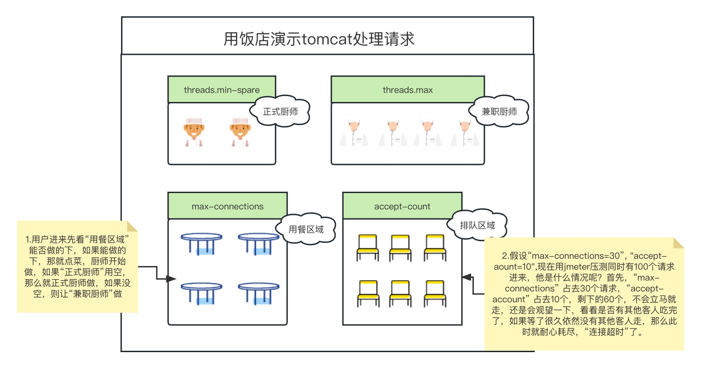

## 1. tomcat 启动
### 1.1 tomcat 相关参数设置

1. server.tomcat.threads.min-spare=10
> 最小线程数，默认值就是10
2. server.tomcat.threads.max=20 
> 最大线程数，默认值是200
3. server.tomcat.max-connections=30
> 同一时间，tomcat允许能连接的最大数, 默认值是 8192。注意：这个属性是属于tomcat的
4. server.tomcat.accept-count=10
> 最大等待数，默认值是 100。 当请求超过max-connections时，多余的请求就会被放入这个队列中。tomcat【NIO】默认同时可以处理的请求就是 [8192 + 100 = 8292]，这个属性是属于tomcat的

参考图片：

### 1.2 APR模式启动tomcat
在tomcat8之后默认是以NIO的模式启动的，如果想以APR模式启动，请[参考文档](https://www.cnblogs.com/yueli/p/9668088.html)

## 2.jetty 启动