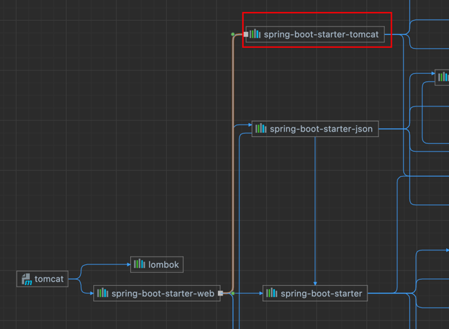

## 1. tomcat
### 1.1 tomcat 相关参数设置

1. server.tomcat.threads.min-spare=10
> 最小线程数，默认值就是10
2. server.tomcat.threads.max=20 
> 最大线程数，默认值是200
3. server.tomcat.max-connections=30
> 同一时间，tomcat允许能连接的最大数, 默认值是 8192。注意：这个属性是属于tomcat的
4. server.tomcat.accept-count=10
> 最大等待数，默认值是 100。 当请求超过max-connections时，多余的请求就会被放入这个队列中。tomcat【NIO】默认同时可以处理的请求就是 [8192 + 100 = 8292]，这个属性是属于tomcat的

参考图片：

### 1.2 APR模式启动tomcat
在tomcat8之后默认是以NIO的模式启动的，如果想以APR模式启动，请[参考文档](https://www.cnblogs.com/yueli/p/9668088.html)

### 1.3 springboot web starter 默认依赖tomcat


## 2.jetty
### 2.1 jetty 启动
```xml
<dependencies>
    <!--
    因为我要使用 webmvc相关的注解或者组件，所以我需要导入这个starter,但是这个starter默认
    依赖了tomcat, 所以我这里要排除掉，然后引入 jetty
    -->
    <dependency>
        <groupId>org.springframework.boot</groupId>
        <artifactId>spring-boot-starter-web</artifactId>
        <exclusions>
            <exclusion>
                <groupId>org.springframework.boot</groupId>
                <artifactId>spring-boot-starter-tomcat</artifactId>
            </exclusion>
        </exclusions>
    </dependency>

    <dependency>
        <groupId>org.springframework.boot</groupId>
        <artifactId>spring-boot-starter-jetty</artifactId>
    </dependency>
</dependencies>
```
### 2.2 jetty 与 tomcat的区别
[参考文档1](https://zhuanlan.zhihu.com/p/341599686) <br>
[参考文档2](https://juejin.cn/post/7208582202011467834)
<br>
二者差异不大， 只是适用场景略有不同
1. 相比tomcat, jetty 更轻量级，更容易拓展。
2. Jetty支持处理大量连接和长连接，顾更适用于web聊天室，即时通信等场景方面


## 3.undertow
### 3.1 undertow 启动
```xml
<dependencies>
    <dependency>
        <groupId>org.springframework.boot</groupId>
        <artifactId>spring-boot-starter-web</artifactId>
        <exclusions>
            <exclusion>
                <groupId>org.springframework.boot</groupId>
                <artifactId>spring-boot-starter-tomcat</artifactId>
            </exclusion>
        </exclusions>
    </dependency>

    <dependency>
        <groupId>org.springframework.boot</groupId>
        <artifactId>spring-boot-starter-undertow</artifactId>
    </dependency>
</dependencies>
```

### 3.2 undertow 与tomcat 的区别
[参考文档](https://blog.csdn.net/qq1311256696/article/details/106745650#:~:text=%E5%9C%A8%E7%A8%8D%E5%A4%8D%E6%9D%82%E7%9A%84%E6%8E%A5%E5%8F%A3%E6%B5%8B%E8%AF%95%E4%B8%8B%EF%BC%8C%20tomcat%20%E5%92%8C%20underwow%20%E7%9A%84%E5%B7%AE%E8%B7%9D%E5%B9%B6%E6%B2%A1%E6%9C%89%E5%BE%88%E5%A4%A7%EF%BC%8C%E4%BD%86%E6%98%AF%20tomcat%20%E5%9C%A8%E5%90%9E%E5%90%90%E9%87%8F%E5%92%8Ccpu%E6%96%B9%E9%9D%A2%E4%BE%9D%E7%84%B6%E5%8D%A0%E6%8D%AE%E4%BA%86%E7%A8%8D%E5%B0%8F%E7%9A%84%E4%BC%98%E5%8A%BF%EF%BC%8C%20jetty,netty%20%E3%80%82%20undertow%20%E6%9B%B4%E9%80%82%E5%90%88%E7%94%A8%E4%BA%8EIO%E5%AF%86%E9%9B%86%E5%9E%8B%E6%9C%8D%E5%8A%A1%E5%99%A8%EF%BC%8C%E6%88%96%E8%80%85%E6%96%87%E4%BB%B6%E6%9C%8D%E5%8A%A1%E5%99%A8%E4%BD%BF%E7%94%A8%20undertow%20%E4%BC%9A%E6%98%AF%E4%B8%80%E4%B8%AA%E4%B8%8D%E9%94%99%E7%9A%84%E9%80%89%E6%8B%A9%EF%BC%8C%E4%BD%86%E6%98%AF%E5%9C%A8%E4%B8%80%E8%88%AC%E6%83%85%E5%86%B5%E4%B8%8B%E8%BF%98%E6%98%AF%E8%80%81%E8%80%81%E5%AE%9E%E5%AE%9E%E7%9A%84%E4%BD%BF%E7%94%A8Springboot%E9%BB%98%E8%AE%A4%E7%9A%84%20tomcat%20%E5%90%A7%E3%80%82)
网上很多例子都在说undertow比tomcat性能更高，但是测试发现并没有格外的突出，所以我也在想这就是为什么springboot依然选择tomcat作为默认容器的原因吧。
<br><br>
也可以看看[这篇文档](https://juejin.cn/post/7209825720384897083)
### 3.3 参数配置
[参考文档](https://blog.csdn.net/z69183787/article/details/129020703)
### 3.4 压测对比
前面我们使用tomcat进行压测时，根据配置的参数，会有很多失败的请求，[参考文档](https://www.yuque.com/qiuguan9/ex5mit/dg1g90ylv8f7hxk0)
<br>
当我使用undertow测试时就没有失败的，全部都处理成功。


